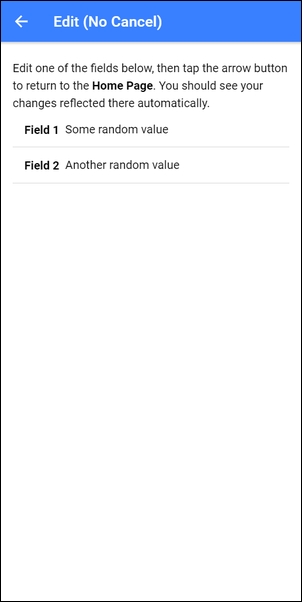

# About Ionic Edit Object Sample

This project shows how to build an Ionic application page that lets users edit data in the application, but with the option to cancel edits. In Ionic apps, most edit pages look like this:



When the user makes changes, they tap the left arrow button to to return to the previous page and all changes are automatically passed to the rest of the app.

What I want is something like this:


Here the user has **Cancel** and **Save** (done) buttons to use to tell the application when they want to keep or discard changes made on the page. 

This second option is a harder implementation because Ionic automatically refreshes changed data everywhere in the application, so when you make changes to **Field 1** and **Field 2** on the page, Ionic helps you out by automatically any UI components that display the data. Helpful, but sometimes annoying.

To get around this feature, you must make a copy of the data object when editing it on a page. Then, when the user taps the **Save** or **Done** button, copy the data object values to the original object. Let me show you how this works.

For this sample application, I started by creating a simple **DataObject** class:

```typescript
export class DataObject {
    field1: string;
    field2: string;
}
```

I placed the file in the project's `app/src/classes/data-object.ts` file. 

Next, in the application's **Home** page, I added the following code to top of the project's `home.page.ts` file:

```typescript
import {DataObject} from '../classes/data-object';
```

This loads the data object class. Inside the `HomePage` class declaration, I created a simple `dataObject` variable we'll use to demonstrate the different options in the sample app:

```typescript
dataObject: DataObject = {
  field1: 'Some random value',
  field2: 'Another random value',
};
```

In the project's **Home** page, I added some HTML to render the data object properties. I added the code to the project's `home.page.html` file:

```html
<ion-item-divider>
  <ion-label>
    Example Data Object
  </ion-label>
</ion-item-divider>
<ion-item>
  <ion-label class="ion-text-wrap">
    <strong>Field 1:</strong> {{dataObject.field1}}
  </ion-label>
</ion-item>
<ion-item>
  <ion-label class="ion-text-wrap">
    <strong>Field 2:</strong> {{dataObject.field2}}
  </ion-label>
</ion-item>
```

At this point, whatever values `dataObject` object has for `field` and `field2` will display on the page, changing automatically when they change elsewhere in the app. Lets see this in action.

In the project's `edit-no-cancel.html`, I created a simple form using the following:

```html
<ion-header>
  <ion-toolbar color="primary">
    <ion-buttons slot="start">
      <ion-back-button></ion-back-button>
    </ion-buttons>
    <ion-title>Edit (No Cancel)</ion-title>
  </ion-toolbar>
</ion-header>

<ion-content class="ion-padding">
  <ion-list>
    <ion-label class="ion-text-wrap">
      Edit one of the fields below, then tap the arrow button to return to the <strong>Home Page</strong>. You should see your changes reflected there automatically.
    </ion-label>
    <ion-item>
      <ion-label><strong>Field 1</strong></ion-label>
      <ion-input type="text" [(ngModel)]="dataObject.field1"></ion-input>
    </ion-item>
    <ion-item>
      <ion-label><strong>Field 2</strong></ion-label>
      <ion-input type="text" [(ngModel)]="dataObject.field2"></ion-input>
    </ion-item>
  </ion-list>
</ion-content>
```


