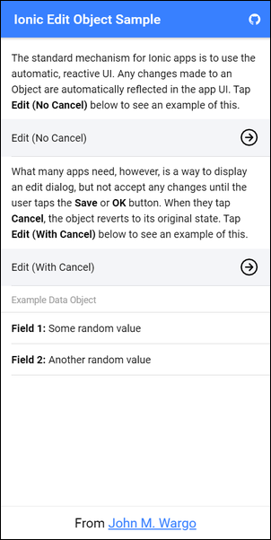
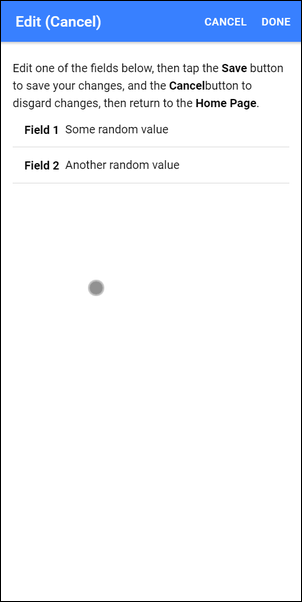

# Ionic Edit Object Sample

Many Ionic books and tutorials illustrate how to build dialogs that render data from the application. For many of these examples, you also learn how to edit data in the dialog. Because Ionic is a reactive framework, any changes you make in the dialog are automatically updated in other parts of the application. 

That doesn't always work for me.

In my Ionic applications (I have one in app stores called [Time Slicer](https://timeslicer.app) plus several others I've built) I always want to give users an opportunity to edit a data element, but change their minds. To accommodate this, you have to use a rarely (well, never that I've seen) documented approach that I demonstrate in this repository.  For a complete write-up describing the code, refer to [Editing Data Objects Using Ionic](https://johnwargo.com).

The application in this repository displays a main screen like the one shown below:




When you tap the first button on the page, you'll see the page shown below. In this approach, any change you made on the page is automatically reflected on the home page when you tap the left arrow button.


Like I said earlier, this is the default behavior for many Ionic apps, but it's not the way most mobile apps work. Most any settings or edit dialog I've ever seen in a mobile app offers save and cancel options to give users the most flexibility in how they use the app.

With the second approach (the second button on the Home page), the edit page gets Save (done) and Cancel options, so you can make changes here then tap **Cancel** to discard the changes before returning to the home page. 




## Running the Application

To run the application, open a terminal window or command prompt, navigate to a working folder for the app, an execute the following commands:

```shell
git clone https://github.com/johnwargo/ionic-edit-object-sample
cd ionic-edit-object-sample
npm install
ionic serve
```

This clones the repo locally, then the remaining commands install required components and launches the app in your default browser.

## Getting Help

I'm not offering Ionic developer support here, but if you have questions **about this app**, use the repo's [Issues](https://github.com/johnwargo/ionic-edit-object-sample/issues) area. I usually check email in the morning and after work, so you should get a response from me in a day or two. 

***

If you find this code useful, and feel like thanking me for providing it, please consider making a purchase from [my Amazon Wish List](https://amzn.com/w/1WI6AAUKPT5P9). You can find information on many different topics on my [personal blog](http://www.johnwargo.com). Learn about all of my publications at [John Wargo Books](http://www.johnwargobooks.com).
